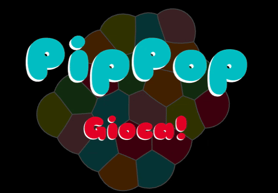

# PipPop

A 2-D bubble-swapping puzzle game without a grid! Join 5 bubbles of the same color to make them pop!

[**Play Online!**](https://scidomino.github.io/pippop/)

# History

I started working on this game as a hobby project way back in 2004. I always meant to get it working well enough to publish it and even got it into beta, but I never got it 100% right. I went through many iterations before I hit on the current system of approximating the bubble walls with cubic beziers and using a full Euler-Lagrange technique.

In 2018, Stu Denman at Pine Street Codeworks independently developed a similar idea and published [Tiny Bubbles](https://play.google.com/store/apps/details?id=com.pinestreetcodeworks.TinyBubbles&hl=en_US) which won many well-deserved awards. Honestly, it's a lot better than my game ever was, and I feel a tiny bit vindicated that he proved the idea was a good one, even if I never found time to properly execute it.

Ultimately, I'm pretty sure the reason it took so long was that I made the classic programmer mistake of using the tools I was familiar with (Java) instead of the right tools for the job (C++, which I have always hated). With Gemini CLI (which I also worked on!), I was able to port this to Rust where it does not suffer from the performance issues that dogged the Java version.
